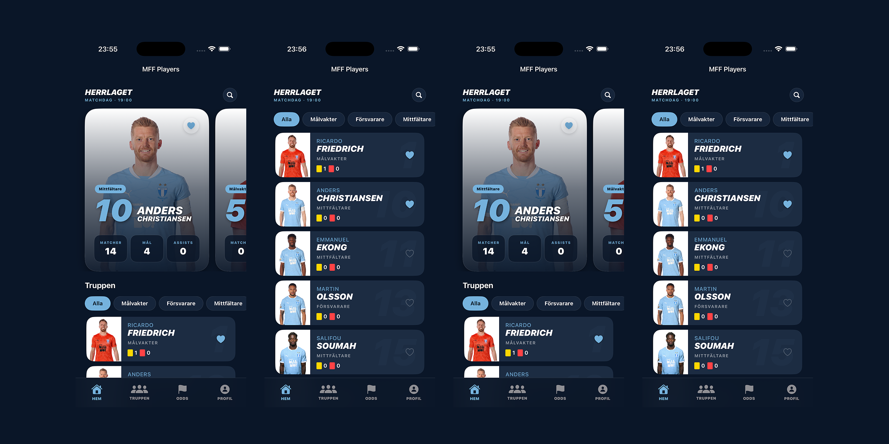

#  MFFPlayerApp 📱⚽️

A **native iOS application** built with modern Swift technologies to track Malmö FF players, designed with scalable architecture and premium UI in mind.

## Features
- **Live Scraping**: Python backend extracts real-time player data from MFF.se.
- **On-Demand Details**: Fetches detailed biography, age, position, and season statistics (Games, Goals, Cards).
- **Native iOS UI**: Built with `SwiftUI` for a smooth, premium feel.
- **Offline Capabilities**: Uses `SwiftData` to cache players for offline access.
- **Pull-to-refresh**: Updates data on demand.

---

## Tech Stack
### Frontend (iOS)
- **SwiftUI** (`List`, `@Observable`, `@Query`)
- **SwiftData** for persistent local storage
- **Swift Concurrency** (`async`/`await`)
- **MVVM + Clean Architecture**:
  - **Features**: View + ViewModels (Presentation Layer)
  - **Data**: Network & Storage Services (Data Layer)
  - **Models**: Shared Domain Entities (Domain Layer)

### Backend (Python)
- **FastAPI** for serving data
- **BeautifulSoup4** for scraping `mff.se`
- **Uvicorn** server

---

## How It Works
1. **Backend Scrapes Data**: `scraper.py` parses `mff.se` HTML.
2. **App Fetches Data**: `PlayerViewModel` requests `GET /players`.
3. **Persistence**: Data is saved to `SwiftData` for offline viewing.

